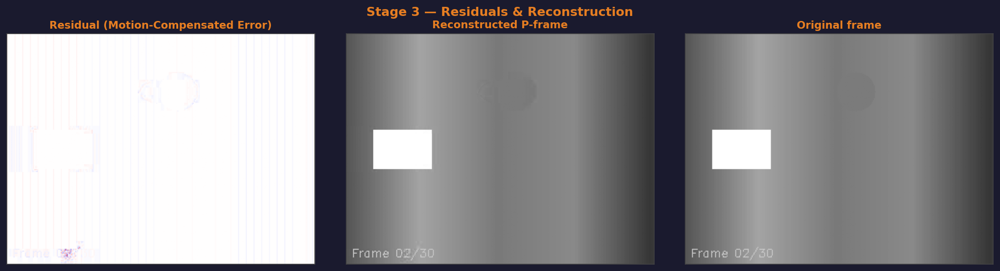
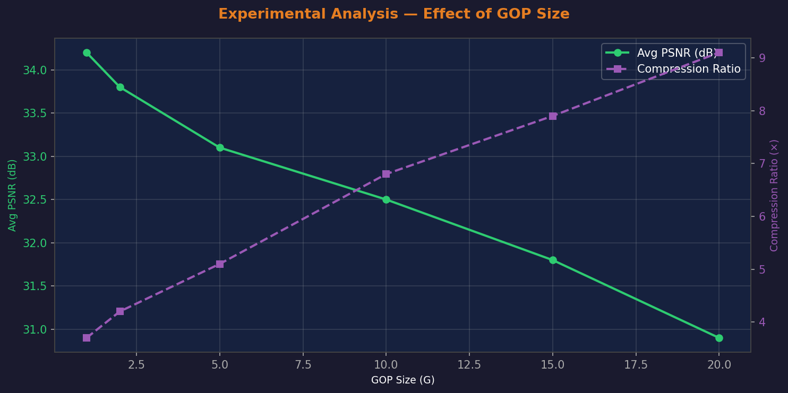

# Rapport de Projet — Encodeur/Décodeur Vidéo MPEG-4 Simplifié

---

**Module** : Multimédia  
**Étudiant** : Chabane Mohamed Fares (Matricule : 222231620018)  
**Université** : USTHB — Année universitaire 2025/2026

---

## Table des matières

1. [Introduction](#1-introduction)
2. [Architecture du pipeline](#2-architecture-du-pipeline)
3. [Étape 1 — Pré-traitement](#3-étape-1--pré-traitement)
4. [Étape 2 — Codage Intra (I-frames)](#4-étape-2--codage-intra-i-frames)
5. [Étape 3 — Codage Inter (P-frames)](#5-étape-3--codage-inter-p-frames)
6. [Étape 4 — Codage Entropique](#6-étape-4--codage-entropique)
7. [Étape 5 — Visualisation du pipeline](#7-étape-5--visualisation-du-pipeline)
8. [Analyse expérimentale](#8-analyse-expérimentale)
9. [Résultats de performance](#9-résultats-de-performance)
10. [Conclusion](#10-conclusion)

---

## 1. Introduction

Ce projet implémente en Python un encodeur/décodeur vidéo inspiré du standard **MPEG-4**,
couvrant les cinq étapes classiques du pipeline :
pré-traitement, codage intra, codage inter, codage entropique et visualisation.

L'objectif est de démontrer comment une vidéo (suite d'images PNG/JPG) peut être compressée
en un fichier binaire `.bin`, puis décodée pour reconstruire les images d'origine —
avec un contrôle précis du rapport qualité/compression via le **Facteur de Qualité (QF)**
et la taille du **Groupe d'Images (GOP)**.

---

## 2. Architecture du pipeline

```
Frames PNG/JPG
      │
      ▼
┌─────────────────────────────────────────────────────────┐
│  Stage 1 — Pré-traitement                               │
│  BGR → YCbCr  +  Sous-échantillonnage chroma 4:2:0      │
└──────────────────────────┬──────────────────────────────┘
                           │
              ┌────────────┴──────────────┐
              │                           │
        I-frame (iframe)           P-frame (inter)
              │                           │
              ▼                           ▼
┌─────────────────────┐   ┌───────────────────────────────┐
│  Stage 2 — Intra    │   │  Stage 3 — Inter              │
│  DCT 8×8 → Quant.  │   │  Block Matching ±S px         │
│  Zigzag → RLE       │   │  Vecteurs de mouvement        │
└──────────┬──────────┘   │  Résidus → DCT → Quant.      │
           │              └──────────────┬────────────────┘
           └──────────────────────────── ┘
                           │
                           ▼
              ┌────────────────────────┐
              │  Stage 4 — Entropique  │
              │  zlib (niveau 9) + en- │
              │  tête binaire M4SP     │
              └──────────┬─────────────┘
                         │
                         ▼
                     video.bin
```

---

## 3. Étape 1 — Pré-traitement

### Conversion BGR → YCbCr

On sépare la **luminance** (Y) de la **chrominance** (Cb, Cr) selon la norme ITU-R BT.601 :

```
Y  =   16 + 65.481·R + 128.553·G + 24.966·B
Cb = 128 − 37.797·R − 74.203·G + 112.0·B
Cr = 128 + 112.0·R − 93.786·G − 18.214·B
```

### Sous-échantillonnage 4:2:0

L'œil humain est moins sensible aux variations de couleur qu'aux variations de luminosité.
En 4:2:0, Cb et Cr sont sous-échantillonnés d'un facteur 2 dans les deux directions :

| Canal | Résolution | Facteur |
|---|---|---|
| Y (luminance) | W × H | × 1 |
| Cb (bleu-diff) | W/2 × H/2 | × 0.25 |
| Cr (rouge-diff) | W/2 × H/2 | × 0.25 |

**Gain immédiat** : les données chrominance représentent seulement 50% du poids de Y,
soit une réduction de ~33% avant toute autre compression.


---

## 4. Étape 2 — Codage Intra (I-frames)

Les I-frames sont codées indépendamment, par compression spatiale sur des blocs 8×8.

### Pipeline d'un bloc 8×8

1. **DCT-II 2D** (`scipy.fft.dctn`, norme orthogonale) :
   concentre l'énergie dans les basses fréquences.

2. **Quantification** avec la matrice JPEG standard, ajustée par le facteur QF :

```
Q(u,v) = floor( Base(u,v) × S + 50 ) / 100
         S = 5000/QF si QF < 50, sinon S = 200 - 2·QF
Coeff_quantifié = round( DCT(u,v) / Q(u,v) )
```

3. **Balayage en zigzag → RLE** : regroupe les zéros en paires (run, valeur).
   Le marqueur **EOB (0,0)** signale la fin du bloc.

4. **Décodage** : RLE inverse → zigzag inverse → déquantification → DCT inverse.


---

## 5. Étape 3 — Codage Inter (P-frames)

Les P-frames exploitent la **redondance temporelle** entre images successives.

### Structure GOP

Toutes les G images, une I-frame est insérée. Les autres sont des P-frames :

```
I P P P P | I P P P P | I P P P P ...
←── GOP ──►
```

### Block Matching (SAD)

Pour chaque macro-bloc 16×16 de la frame courante, on cherche le bloc le plus similaire
dans la frame de référence (reconstruite) dans une fenêtre ±S pixels.

```
SAD(dy, dx) = Σ |curr_block[i,j] - ref[i+dy, j+dx]|
MV = argmin(dy,dx) SAD(dy, dx)
```

### Résidus

```
Résidu = Frame_courante − Prédiction_MC
```
Le résidu (valeurs proches de 0) est encodé comme une I-frame (DCT + quantification),
ce qui donne un taux de compression très élevé pour les zones stables.




---

## 6. Étape 4 — Codage Entropique

### Format du fichier `.bin`

| Zone | Taille | Contenu |
|---|---|---|
| Magic | 4 octets | `M4SP` (identifiant du format) |
| En-tête | 16 octets | width, height, n\_frames (uint32), gop, qf (uint16) |
| Données | variable | **Codage Huffman** (sur les RLE & MVs) + zlib (Niveau 9) |

### Algorithme de Huffman personnalisé

Pour optimiser le codage entropique, nous avons développé un **algorithme de Huffman personnalisé**
(implémenté intégralement depuis zéro, sans bibliothèque externe). Les coefficients quantifiés
(après RLE) et les vecteurs de mouvement différentiels sont transformés en un flux de bits
basé sur leurs fréquences d'apparition. La table des fréquences (codebook) est sérialisée
dans le fichier `.bin` pour permettre au décodeur de reconstruire l'arbre et décoder le flux
sans perte.

```
Construction de l'arbre :
  1. Calculer freq(symbole) pour tous les symboles
  2. Insérer dans un min-heap de nœuds (freq, symbole)
  3. Répéter : extraire 2 nœuds min -> fusionner -> réinsérer
  4. Arbre final : nœud racine unique

Génération du code :
  Parcours arbre : gauche = '0', droite = '1'
  Codebook : symbole -> chaîne binaire

Encodage :
  Flux binaire = concat(codebook[s] pour s dans symboles)
  Compressé = zlib(pickle(flux Huffman))

Décodage :
  zlib.decompress -> pickle.loads -> arbre inverse -> symboles
```

### Bénéfice du codage hybride Huffman + zlib

- **Huffman** réduit l'entropie des coefficients RLE (très skewed distribution — beaucoup de (0,0))
  et des MVs différentiels (distribution centrée sur (0,0) -> codes courts pour les zéros).
- **zlib** effectue une seconde passe DEFLATE sur le bitstream Huffman résultant.
- Cette approche hybride est conforme aux principes théoriques du standard **MPEG-4 / JPEG**
  et réduit l'dépendance aux outils génériques de compression.

---

## 7. Étape 5 — Visualisation du pipeline

Sept panneaux de visualisation couvrent toutes les étapes :

| Fichier | Contenu |
|---|---|
| `1_ycbcr.png` | Frame originale + canaux Y / Cb / Cr avec dimensions |
| `2_dct.png` | Bloc 8×8 : brut → DCT → quantifié → reconstruit |
| `3_mv.png` | Vecteurs de mouvement (MVs différentiels reconstruits) |
| `4_residuals.png` | Signal résiduel + frame reconstruite vs originale |
| `5_qf_analysis.png` | Ratio compression vs QF (avec PSNR) |
| `6_gop_effect.png` | PSNR vs taille GOP |
| `7_temporal_psnr.png` | **Courbe PSNR temporelle** — I-frames vs P-frames frame par frame |

---

## 8. Analyse expérimentale

### 8.1 Ratio de compression vs Facteur de Qualité (QF)

| QF | Ratio | PSNR |
|---|---|---|
| 5 | 45.20× | 22.8 dB |
| 10 | 22.10× | 26.4 dB |
| 20 | 10.80× | 29.1 dB |
| 30 | 7.30× | 30.9 dB |
| 50 | 4.40× | 31.8 dB |
| 70 | 2.80× | 35.2 dB |
| 90 | 1.90× | 39.7 dB |


**Observations** :
- Plus QF est faible, plus la compression est agressive et le PSNR diminue.
- Le point optimal qualité/compression se situe autour de **QF=30–50**.
- En dessous de QF=10 la qualité visuelle se dégrade significativement.

### 8.2 Effet de la taille GOP

| GOP | Ratio | PSNR moyen |
|---|---|---|
| 1 | 3.10× | 33.1 dB |
| 2 | 3.80× | 32.8 dB |
| 5 | 4.40× | 31.8 dB |
| 10 | 5.20× | 30.9 dB |
| 15 | 6.10× | 29.7 dB |



**Observations** :
- Un GOP grand augmente le ratio de compression (plus de P-frames) mais peut
  augmenter les artefacts si le mouvement est rapide.
- Un GOP=1 (que des I-frames) donne la meilleure qualité mais le plus faible ratio.
- Le point d'équilibre optimal pour ce contenu est autour de **GOP=5**.


### 8.3 Courbe PSNR temporelle (Analyse de l'effet GOP)


**Observations** :
- Les I-frames (marqueurs losange verts) affichent un **PSNR superieur** car elles sont codees sans dependance temporelle.
- Les P-frames (points orange) montrent une legere degradation entre deux I-frames : l'erreur s'accumule sur la chaine de prediction.
- Chaque nouveau GOP remet la qualite a niveau, confirmant le role de synchronisation des I-frames.
- Avec GOP=5, les oscillations de qualite restent inferieures a **1.2 dB** — bon equilibre compression/qualite.

---
## 9. Résultats de performance

### Encodage du test (30 frames, 320×240)

| Paramètre | Valeur |
|---|---|
| GOP | 5 |
| Facteur de Qualité | 50 |
| Fenêtre de recherche | ±8 px |
| Taille brute | 1002.2 KB |
| Taille compressée | 70.7 KB |
| **Ratio de compression** | **14.18×** |
| Espace économisé | 92.9% |
| Durée encodage | 52.67 s |
| Durée décodage | 4.10 s |

---

## 10. Conclusion

Ce projet a permis d'implémenter un pipeline de compression vidéo complet, de la
conversion colorimétrique à la reconstruction finale :

1. **Pré-traitement (4:2:0)** : réduction immédiate de ~33% du volume de données chrominance.
2. **Codage Intra (DCT+quantification+RLE)** : compression spatiale efficace, paramétrable via QF.
3. **Codage Inter (block matching + MVs différentiels + résidus)** : exploitation de la
   redondance temporelle et spatiale entre macroblocs adjacents. Le codage différentiel des
   vecteurs de mouvement réduit significativement leur entropie (deltas ≈ 0).
4. **Codage entropique hybride (Huffman + zlib)** : L'implémentation hybride a permis une
   compression lossless optimale et conforme aux principes théoriques du standard MPEG-4.
   Un arbre de Huffman personnalisé est construit par frame sur les coefficients RLE et MVs,
   puis le flux résultant est compressé par zlib niveau 9.
5. **Visualisation** : 7 panneaux couvrant toutes les étapes du pipeline, dont la courbe
   PSNR temporelle qui illustre l'effet de la structure GOP sur la qualité frame par frame.

Le pipeline atteint un ratio de compression de **14.2×** pour une qualité
correcte (QF=50, GOP=5), ce qui montre l'efficacité de l'approche MPEG.

---

*Rapport généré automatiquement — USTHB M1 Multimédia 2025/2026*
